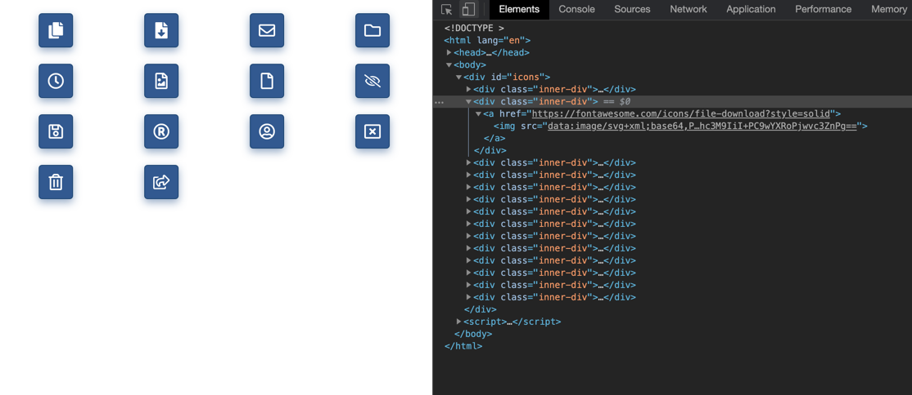
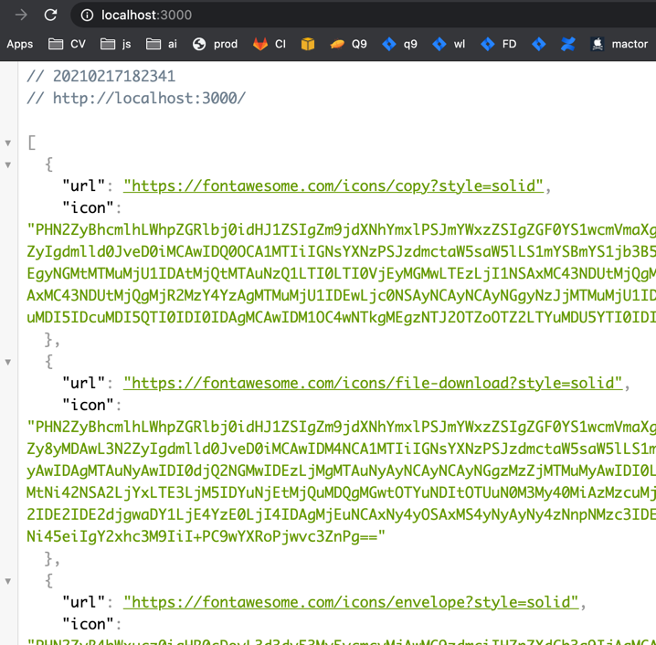
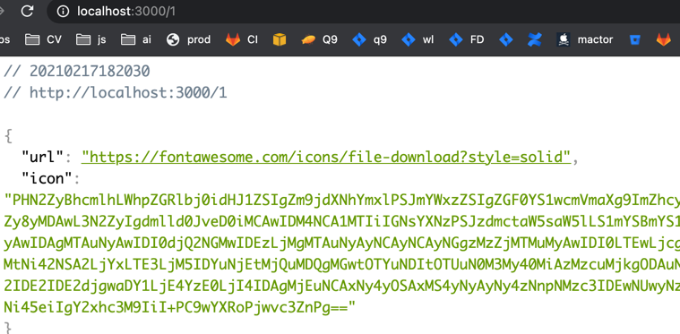

ALOHA TEST

Run `npm i` for install deps  
Run `npm run start` for start project on _http://localhost:3000_ 

index.html do request on window load 

API provide two types of endpoints: 
1) `get` to `/` return array with all data 

   
2) `get` to `/:id` return an object with url/icon

